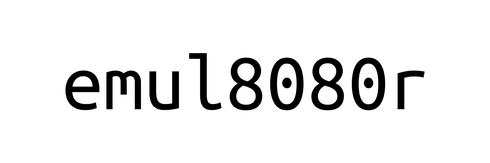
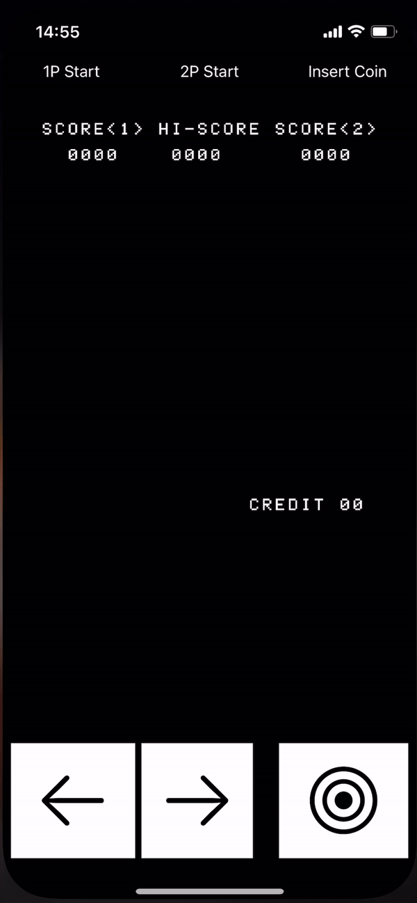

    

    
    
     

**Emul8080r** is an Intel 8080 emulator written in Swift! Created initially to support a full emulation of the classic Space Invaders 👾 game on Apple platforms, found [here](https://github.com/timsearle/SpaceInvaders).

### Getting started

The core type to get started with is `CPU`, this is where the all the instruction handling is interpreted, with all the helper functions for each instruction found in `CPU+InstructionHelpers`. Get started by initialising an instance of `CPU` with the available RAM and an implementation of a `SystemClock` to allow the emulate to approximate the speed at which it should be operating on the native system.

The Intel 8080 supported 256 instructions and emul8080r handles this via a switch from `0x00` through to `0xff`.

### In Action

### Work in progress

There are still many unimplemented instructions as the initial goal was to get Space Invaders running, over time will finalise populating these missing instructions and contributions are of course welcome!

There is a chance there are currently issues with certain instructions that yet to be discovered - I did not prioritise unit tests during the initial implementation but this is something planned to be improved over time! If you spot an issue, feel free to raise a PR.

**Outstanding Instructions**

| Instruction Value | Instruction Name |
| ------------------- | -------------------  |
| 0x02                    | STAX B       |
| 0x08                    | ?       |
| 0x0b                    | DCX B       |
| 0x10                    | ?       |
| 0x17                    | RAL       |
| 0x18                    | ?       |
| 0x1c                    | INR E       |
| 0x1d                    | DCR E       |
| 0x20                    | ?      |
| 0x25                    | DCR H       |
| 0x28                    | ?       |
| 0x2d                    | DCR L       |
| 0x30                    | ?       |
| 0x33                    | INX SP       |
| 0x38                    | ?      |
| 0x39                    | DAD SP       |
| 0x3b                    | DCX SP      |
| 0x3f                     | CMC       |
| 0x76                    | HLT       |
| 0x98                    | SBB B       |
| 0x99                    | SBB C      |
| 0x9a                    | SBB D       |
| 0x9b                    | SBB E       |
| 0x9c                    | SBB H      |
| 0x9d                    | SBB L       |
| 0x9e                    | SBB M       |
| 0x9f                     | SBB A       |
| 0xa9                    | XRA C       |
| 0xaa                    | XRA D       |
| 0xab                    | XRA E      |
| 0xac                    | XRA H      |
| 0xad                    | XRA L      |
| 0xae                    | XRA M       |
| 0xc7                    | RST 0       |
| 0xcb                    | ?       |
| 0xce                    | ACI D8       |
| 0xcf                     | RST 1       |
| 0xd7                    | RST 2       |
| 0xd9                    | ?       |
| 0xdc                    | CC adr       |
| 0xdd                    | ?       |
| 0xdf                     | RST 3       |
| 0xe2                    | JPO adr       |
| 0xe4                    | CPO adr       |
| 0xe7                    | RST 4       |
| 0xea                    | JPE adr       |
| 0xec                    | CPE adr       |
| 0xed                    | ?       |
| 0xee                    | XRI D8       |
| 0xef                     | RST 5       |
| 0xf2                     | JP adr       |
| 0xf4                     | CP adr       |
| 0xf7                     | RST 6       |
| 0xf9                     | SPHL       |
| 0xfc                     | CM adr       |
| 0xfd                     | ?       |
| 0xff                      | RST 7       |

### Thanks

* [emulator101.com](https://www.emulator101.com) - if it wasn't for this site, this almost certainly would've taken me far longer to produce.
* [classiccmp.org](http://www.classiccmp.org/dunfield/r/8080.txt) - a brilliant, high-level mapping of instruction values to descriptions
* [computerarcheology.com](http://computerarcheology.com/Arcade/SpaceInvaders/) - this site proved invaluable for debugging my implementation, understanding ROM and RAM ranges and just how Space Invaders originally operated on the 8080 and its associated hardware, helping me to build my own version [here](https://github.com/timsearle/SpaceInvaders).
* <a href="Files/8080asm.pdf"> Official Intel 8080 Assembly manual</a>

### Contributing

Happy to receive any and all contributions relating directly to making this package a more accurate reflection of an Intel 8080 processor! Please do raise PRs including instruction implementations/bug fixes/enhancements alongside a unit test.
